    

    <b>Automatic Architecture Diagrams from Code</b> 
    <a href="https://github.com/swark-io/swark">GitHub</a> • <a href="https://swark.io">Website</a> • <a href="mailto:contact@swark.io">Contact Us</a>

## Usage Instructions

1. **Render the Diagram**: Use the links below to open it in Mermaid Live Editor, or install the [Mermaid Support](https://marketplace.visualstudio.com/items?itemName=bierner.markdown-mermaid) extension.
2. **Recommended Model**: If available for you, use `claude-3.5-sonnet` [language model](vscode://settings/swark.languageModel). It can process more files and generates better diagrams.
3. **Iterate for Best Results**: Language models are non-deterministic. Generate the diagram multiple times and choose the best result.

## Generated Content
**Model**: GPT-4o - [Change Model](vscode://settings/swark.languageModel)  
**Mermaid Live Editor**: [View](https://mermaid.live/view#pako:eNqNVtuO2yAQ_RXLz7s_kIdKq1ykrtI22mTVBxxVxJ7YbG2wAEd1V_vvxdyCsb3qQ5KZcw7DADOQ9zRnBaSrNKMlx22VnDYZTRLRXYy7ZlTCHykGMElOFTRgIRQ6Z8M_dbJydGBrFmiR0VHsI_AbycHGvhIOFyzAomhnfSezU7yxjlNcO9WzcSMR0Jz3rYTieazeOjyZH4cV1EuSCzfgyQGR8EqgLmw0wug9ZwUnd3wyyixp2JrJMgdwpJ9u2Jo1LaNA3XF4Yo971kkDJsl3fLtgjszP2aH6uE6sLGtAge35V4pVBoyTv1Cg0PF7atMJ5h1yduP3rCQU6W8f8wVKIiRw5AzPHDi7EpWJ_Q1xCbk6oRe1IE0H7ieZ2PN0Yay7V5OiwD5H_JZK3u8Yb1AMxMoNSExqNPI-SecrFaSspPjlwjgAOcNPsG3YUCoblR4nl26w0Qzm9Ud1_qRRX7o2BRFogsSxxY8b8JOSoBjwyp-MF-uadQXy1p3jRBJaHrBUJ0gFinyv-8ZYsWacQ431JCgGphu2waK6MMwL5K2F2n-VpLZlL7H4rV10UpZmVELgwuc4r8Dw68GMBNPQh16VOvWtbqIMuatjVsXHuF5I4jw7ze7_7isfdktVZ4Q3igHGOT21LVKfc_L4-MX2sYU14jcpBHXLhYBrthCzfRZCQV_MwL4TZjhT_iHhqtqswiSuieCmiZjgfZgb46mBDFLVioX7fU7qi2UUya9Oa96Wooxl8euwKBwtbVC57VkMMxLMdP9EM-n5pSi-1ScC3-hTZtzgEz7ua7PImddNq6OHfZCON3xJtXDKC0cWb6sp-7i104e0Ad5gUqj_PO9ZKoday9JVkqUFXHFXyyz9UKKuLbCEDcHqimjSleQdPKTqTWTHnubO56wrq3R1xbWAj39nLUdk) | [Edit](https://mermaid.live/edit#pako:eNqNVtuO2yAQ_RXLz7s_kIdKq1ykrtI22mTVBxxVxJ7YbG2wAEd1V_vvxdyCsb3qQ5KZcw7DADOQ9zRnBaSrNKMlx22VnDYZTRLRXYy7ZlTCHykGMElOFTRgIRQ6Z8M_dbJydGBrFmiR0VHsI_AbycHGvhIOFyzAomhnfSezU7yxjlNcO9WzcSMR0Jz3rYTieazeOjyZH4cV1EuSCzfgyQGR8EqgLmw0wug9ZwUnd3wyyixp2JrJMgdwpJ9u2Jo1LaNA3XF4Yo971kkDJsl3fLtgjszP2aH6uE6sLGtAge35V4pVBoyTv1Cg0PF7atMJ5h1yduP3rCQU6W8f8wVKIiRw5AzPHDi7EpWJ_Q1xCbk6oRe1IE0H7ieZ2PN0Yay7V5OiwD5H_JZK3u8Yb1AMxMoNSExqNPI-SecrFaSspPjlwjgAOcNPsG3YUCoblR4nl26w0Qzm9Ud1_qRRX7o2BRFogsSxxY8b8JOSoBjwyp-MF-uadQXy1p3jRBJaHrBUJ0gFinyv-8ZYsWacQ431JCgGphu2waK6MMwL5K2F2n-VpLZlL7H4rV10UpZmVELgwuc4r8Dw68GMBNPQh16VOvWtbqIMuatjVsXHuF5I4jw7ze7_7isfdktVZ4Q3igHGOT21LVKfc_L4-MX2sYU14jcpBHXLhYBrthCzfRZCQV_MwL4TZjhT_iHhqtqswiSuieCmiZjgfZgb46mBDFLVioX7fU7qi2UUya9Oa96Wooxl8euwKBwtbVC57VkMMxLMdP9EM-n5pSi-1ScC3-hTZtzgEz7ua7PImddNq6OHfZCON3xJtXDKC0cWb6sp-7i104e0Ad5gUqj_PO9ZKoday9JVkqUFXHFXyyz9UKKuLbCEDcHqimjSleQdPKTqTWTHnubO56wrq3R1xbWAj39nLUdk)

```mermaid

graph TD
  subgraph Contexts
    ThemeContext[ThemeContext]
    AuthContext[AuthContext]
  end

  subgraph Services
    firebaseService[Firebase Service]
    journalService[Journal Service]
    encryptedJournalService[Encrypted Journal Service]
    analyticsService[Analytics Service]
    fieldEncryptionService[Field Encryption Service]
    firebaseAuthService[Firebase Auth Service]
  end

  subgraph Components
    subgraph Layout
      Navbar[Navbar]
      ThemeToggle[ThemeToggle]
      Unauthorized[Unauthorized]
    end

    subgraph Auth
      Login[Login]
      Register[Register]
      Profile[Profile]
      ProtectedRoute[ProtectedRoute]
    end

    subgraph Journal
      JournalList[JournalList]
      JournalEntryForm[JournalEntryForm]
      JournalDetail[JournalDetail]
    end

    subgraph Insights_
      Insights[Insights]
      EmotionDistribution[EmotionDistribution]
      SentimentAnalysis[SentimentAnalysis]
      EmotionsOverTime[EmotionsOverTime]
      WordCloud[WordCloud]
      WritingPatterns[WritingPatterns]
      MoodCorrelations[MoodCorrelations]
    end

    Dashboard[Dashboard]
  end

  subgraph Utils
    taskUtils[Task Utilities]
    cacheUtils[Cache Utilities]
  end

  subgraph PythonAnalytics
    MoodDetector[Mood Detector]
    FirebaseService[Firebase Service]
    AnalyticsEngine[Analytics Engine]
  end

  App[App] --> Navbar
  App --> Dashboard
  App --> Login
  App --> Register
  App --> Profile
  App --> JournalList
  App --> JournalEntryForm
  App --> JournalDetail
  App --> Insights

  Navbar --> ThemeToggle
  Navbar --> AuthContext
  Navbar --> ThemeContext

  JournalList --> encryptedJournalService
  JournalList --> taskUtils

  JournalEntryForm --> journalService
  JournalEntryForm --> analyticsService
  JournalEntryForm --> AuthContext

  Insights --> analyticsService
  Insights --> EmotionDistribution
  Insights --> SentimentAnalysis
  Insights --> EmotionsOverTime
  Insights --> WordCloud
  Insights --> WritingPatterns
  Insights --> MoodCorrelations

  firebaseAuthService --> firebaseService
  journalService --> firebaseService
  encryptedJournalService --> journalService
  analyticsService --> PythonAnalytics

```

