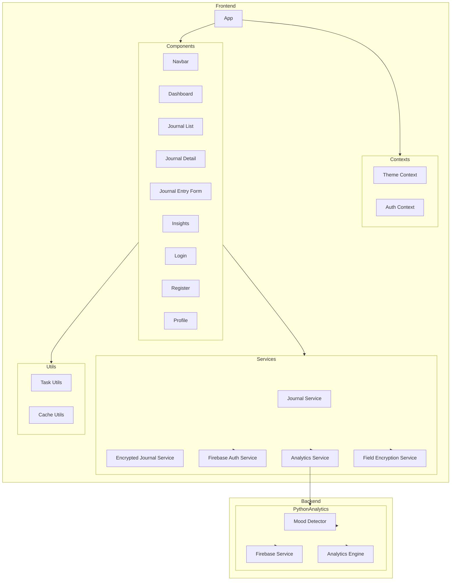

    

    <b>Automatic Architecture Diagrams from Code</b> 
    <a href="https://github.com/swark-io/swark">GitHub</a> • <a href="https://swark.io">Website</a> • <a href="mailto:contact@swark.io">Contact Us</a>

## Usage Instructions

1. **Render the Diagram**: Use the links below to open it in Mermaid Live Editor, or install the [Mermaid Support](https://marketplace.visualstudio.com/items?itemName=bierner.markdown-mermaid) extension.
2. **Recommended Model**: If available for you, use `claude-3.5-sonnet` [language model](vscode://settings/swark.languageModel). It can process more files and generates better diagrams.
3. **Iterate for Best Results**: Language models are non-deterministic. Generate the diagram multiple times and choose the best result.

## Generated Content
**Model**: GPT-4o - [Change Model](vscode://settings/swark.languageModel)  
**Mermaid Live Editor**: [View](https://mermaid.live/view#pako:eNp1lMFuozAQhl_F8rl9gRwqZZtEatWuqm33ZHpwYAJWwUa2qYqqvnttgwdi4JAw883v8TAe801zVQDd0UyWmrcVeTtkkhDTnQf3pJW0IAsPZ_je0y9rBkzIWwUNjJAFJ0reo2Tf2SoqvJ0I1vZoWiVBTrv85Z9nrtnwwMQHbqqz4rpgaGHsUXVa8vpJGMtGm3gnFRzAclGjZHBT0VFa3Z-UblAXCPEItQ_SiLKyhkUDI0-qFJKFf2T_oHTVgGbRwMiLVhdRAxufm116Bf0pcjBJrSPGSkcf0x9lrvvWQpHokZOtlSeh4cwN-DOMqyILh7xYsXdpeityE-UIVpJDXYw1CCWn_A6TiSfrll35b0U9DSc3HwEwbw0x3PGe5xUM0WBehTHxvm2Z-wUc4NUl-cPzj2UNL72tlMR3jRs-K1W4-YLcKs28Q6K3aPGivZudPUo3VfPGDuD6NbBw9ybk9vbu6hZPbH7rJi8E58OWhLDjURPoyrAsNOl4rCRZG4pQdLI0yFf6nqAgm5_DliY5iC1ZcgyZpDe0Ad1wUbgv63dGrf8iZnRHMlrAhXe1zeiPE3VtwS0cBHcT09Cd1R3cUN5Z9drLPPpadWVFdxdeG_j5BcHb9sg) | [Edit](https://mermaid.live/edit#pako:eNp1lMFuozAQhl_F8rl9gRwqZZtEatWuqm33ZHpwYAJWwUa2qYqqvnttgwdi4JAw883v8TAe801zVQDd0UyWmrcVeTtkkhDTnQf3pJW0IAsPZ_je0y9rBkzIWwUNjJAFJ0reo2Tf2SoqvJ0I1vZoWiVBTrv85Z9nrtnwwMQHbqqz4rpgaGHsUXVa8vpJGMtGm3gnFRzAclGjZHBT0VFa3Z-UblAXCPEItQ_SiLKyhkUDI0-qFJKFf2T_oHTVgGbRwMiLVhdRAxufm116Bf0pcjBJrSPGSkcf0x9lrvvWQpHokZOtlSeh4cwN-DOMqyILh7xYsXdpeityE-UIVpJDXYw1CCWn_A6TiSfrll35b0U9DSc3HwEwbw0x3PGe5xUM0WBehTHxvm2Z-wUc4NUl-cPzj2UNL72tlMR3jRs-K1W4-YLcKs28Q6K3aPGivZudPUo3VfPGDuD6NbBw9ybk9vbu6hZPbH7rJi8E58OWhLDjURPoyrAsNOl4rCRZG4pQdLI0yFf6nqAgm5_DliY5iC1ZcgyZpDe0Ad1wUbgv63dGrf8iZnRHMlrAhXe1zeiPE3VtwS0cBHcT09Cd1R3cUN5Z9drLPPpadWVFdxdeG_j5BcHb9sg)

